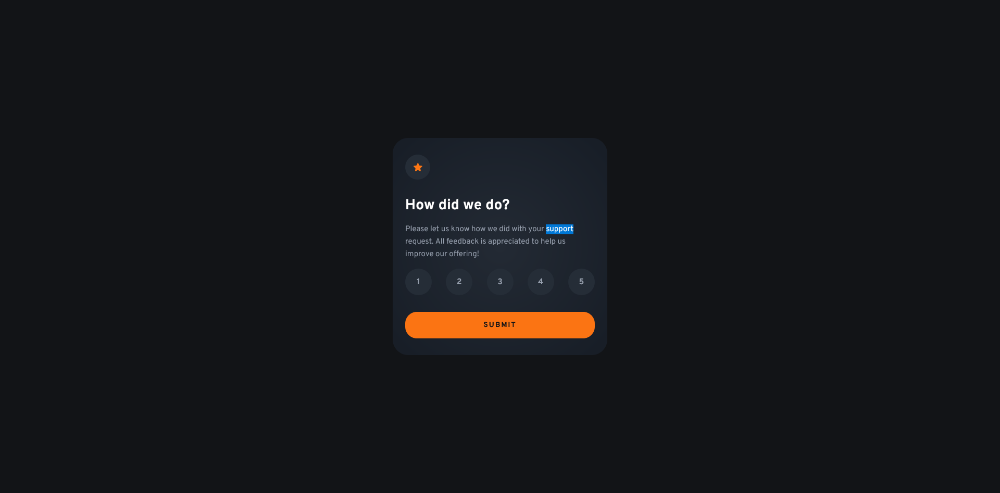
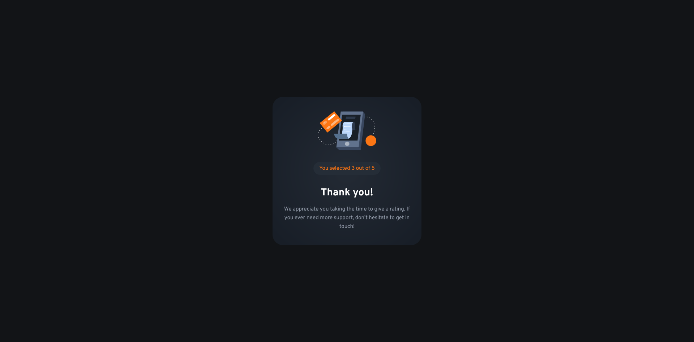

# Frontend Mentor - Interactive rating component solution

This is a solution to the [Interactive rating component challenge on Frontend Mentor](https://www.frontendmentor.io/challenges/interactive-rating-component-koxpeBUmI). Frontend Mentor challenges help you improve your coding skills by building realistic projects. 

## Table of contents

- [Overview](#overview)
  - [The challenge](#the-challenge)
  - [Screenshot](#screenshot)
  - [Links](#links)
  - [Built with](#built-with)
  - [What I learned](#what-i-learned)
- [Author](#author)

## Overview

This project includes a simple rating component where users can choose a rating and submit the form. After submission, you are redirected to a thank you page that shows what you selected.

### The challenge

Users should be able to:

- View the optimal layout for the app depending on their device's screen size
- See hover states for all interactive elements on the page
- Select and submit a number rating
- See the "Thank you" card state after submitting a rating

### Screenshot

Default:


Confirmation:


### Links

- Solution URL: [https://www.frontendmentor.io/solutions/interactive-rating-component-with-thank-you-page-and-error-handling-TOYCmcZMDd](https://www.frontendmentor.io/solutions/interactive-rating-component-with-thank-you-page-and-error-handling-TOYCmcZMDd)
- Live Site URL: [https://schindlerdumagat.github.io/interactive-rating-component/](https://schindlerdumagat.github.io/interactive-rating-component/)

### Built with

- Semantic HTML5 markup
- CSS custom properties
- JavaScript
- Flexbox
- Mobile-first workflow
- [BEM](https://getbem.com/) - Block, Element, Modifier

### What I learned

I built this project with accessibility in mind. I used semantic HTML, applied hover and focus styles for keyboard users as well. I used some aria attributes and add visually hidden styling for accessibility purposes.

```html
<!-- With aria attributes -->
<section class="confirm hidden" aria-hidden="true">
  
  <p class="confirm__rating-text">You selected <span class="confirm__rating"></span> out of 5</p>
  <h2 class="confirm__title">Thank you!</h2>
  <p class="confirm__description">We appreciate you taking the time to give a rating. If you ever need more support, don’t hesitate to get in touch!</p>
</section>

<!-- With visually hidden -->
<li class="form__rate-item">
  <label class="form__rate-number" for="rated-1">1</label>
  <input class="form__rate-input visually-hidden" type="radio" name="rating" id="rated-1" value="1" aria-describedby="form-error">
</li>
```

```css
/* Hover and focus styles for mouse and keyboard users */
.form__rate-number:hover {
  color: var(--clr-grey-900);
  background-color: var(--clr-orange-500); 
}

.form__rate-number:has(+ .form__rate-input:checked) {
  background-color: var(--clr-white);
  color: var(--clr-grey-900);
}

.form__rate-number:has(+ .form__rate-input:focus-visible:not(:checked)) {
  outline: 1px solid var(--clr-orange-500);
  outline-offset: 2px;
  background-color: var(--clr-orange-500);
  color: var(--clr-grey-900);
}

.form__rate-number:has(+ .form__rate-input:focus-visible:checked) {
  outline: 1px solid var(--clr-white);
  outline-offset: 2px;
}
```

## Author

- Website - [Schindler Dumagat](https://schindlerdumagat.github.io/webportfolio/)
- Frontend Mentor - [@schindlerdumagat](https://www.frontendmentor.io/profile/schindlerdumagat)
- LinkedIn - [@schindler-dumagat-015238230](https://www.linkedin.com/in/schindler-dumagat-015238230/)
